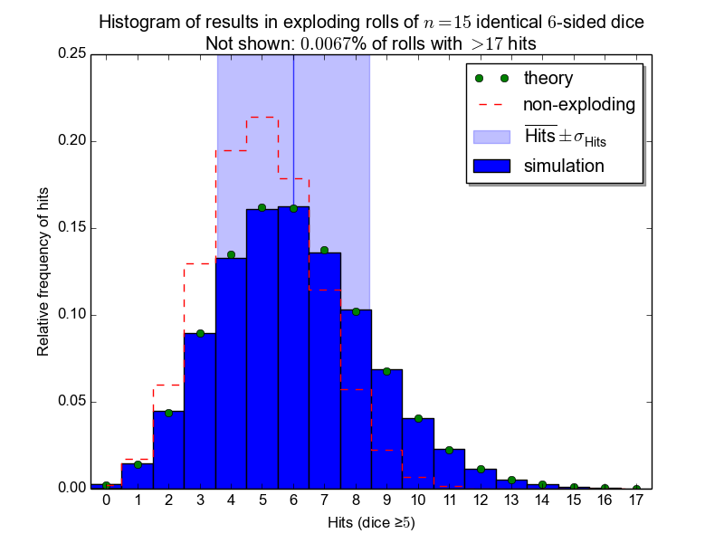

# Exploding-Diepool
Little scripts related to exploding dice pools.

Here is a (buggy) [html page](http://con-f-use.github.io/Exploding-Diepool/) that might be useful to some P&P games. For an example of a python plot see image below:

### Acknowledgements

Many thanks to Brian Tung and the other folks at Mathematics Stackexchange that were kind enough to ponder (and answer) my [question](http://math.stackexchange.com/q/1644794/11949).
