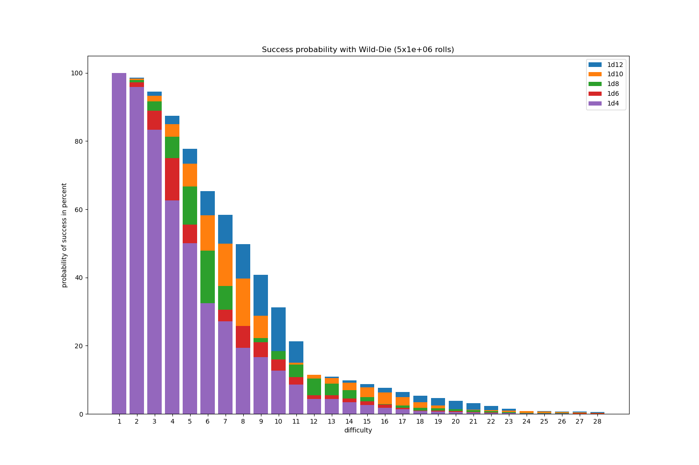

# Exploding-Diepool

Little scripts related to exploding die pools, also known as open-ended dice pools.

Say we role `n` identical, fair dice, each with `d` sides (every side comes up with the same probability `1/d`). On each die, the sides are numbered from `1` to `d` with no repeating number, as you would expect from an ordinary `d`
sided die.

Every die in the outcome that shows a number equal or higher than the threshold number `t` is said to show a hit (also known as success). Every die that shows the maximum result of `d` is rolled again, which we call "exploding". We say the roll is "open-ended". If the re-rolled dice show hits, the number of hits is added to the hit count. Dice that show the maximum after re-rolling are rolled again and their hits counted until none show a maximum result. Given the values of

 - `d` ... Number of sides on each die  `d > 0`
 - `n` ... Number of dies rolled  `n ≥ 0`
 - `h` ... Number of hits, we want the probability for
 - `t` ... Threshold value for a die to roll a hit  `0 < t ≤ d`

what is the probability to get exactly exactly `h` hits? 

**Example:** 

We roll 7 six-sided dice and count those as hits that show a 5 or a 6. In this example, `d = 6`, `n = 7`, `t = 5`. The outcome of such a roll may be `6,5,1,2,3,6,1`. That's three hits so far, but we have to roll the two sixes again (they explode). This time it's `6, 2`. One more hit, and one more die to roll. We are at four hits at this point. The last die to be re-rolled shows `6` again, we re-roll it yet another time. On the last re-roll it shows a `4` - no more hits. That gives five hits in total and the roll is complete. So, for this roll `h = 5`.

The theory says:

Here is a (buggy) [html page](http://con-f-use.github.io/Exploding-Diepool/) that might be useful to some P&P games. For an example of a python plot see the image above.

### Acknowledgements

Many thanks to Brian Tung and the other folks at Mathematics Stackexchange that were kind enough to ponder (and answer) my [question](http://math.stackexchange.com/q/1644794/11949).

# Savage Worlds

Here is the die roll situation for Savage Worlds, where you take the higher result of an exploding d6 ("Wild Die") and that of one of a d4, d6, d8, d10 or d12 that also explodes.
The steps in mean reslut from one die to the next are: 0.5, 0.7, 0.7, 0.9.

Also note the gaps at common products in the graph below.

